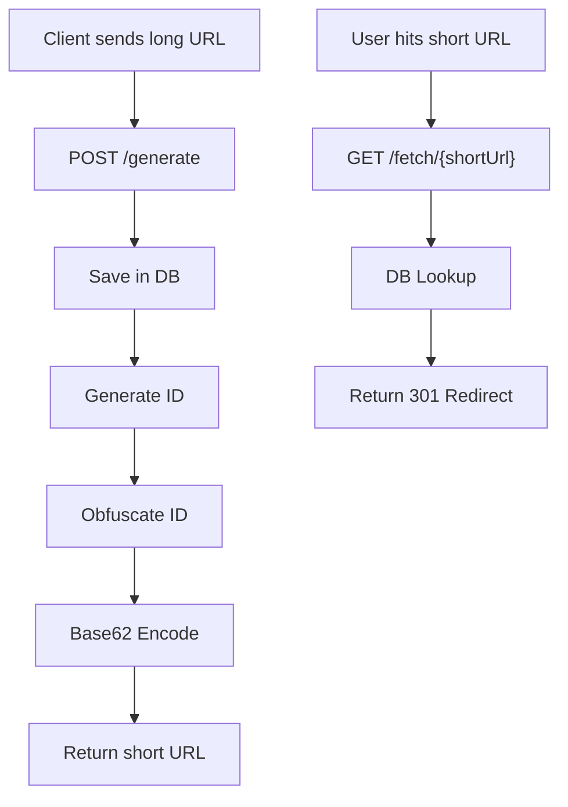
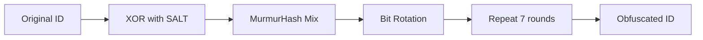
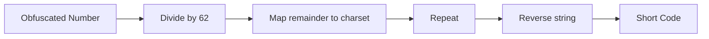
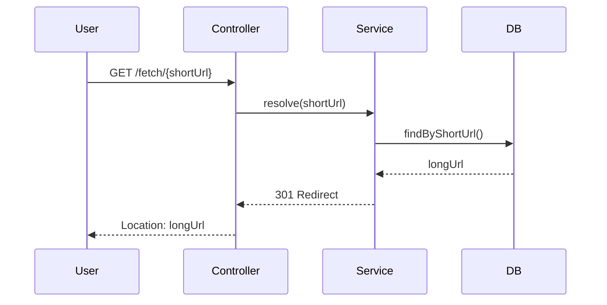
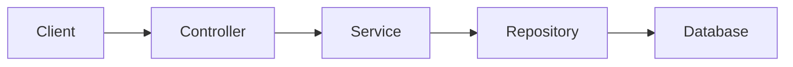
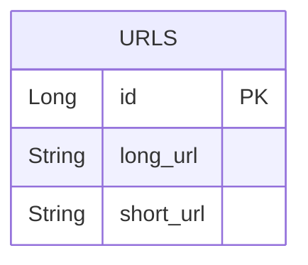
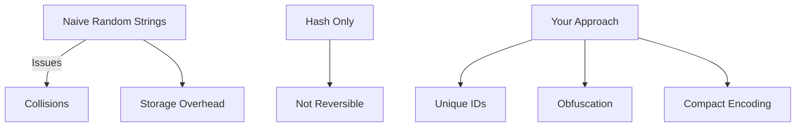

# 🔗 URL Shortener

## 🚀 Overview
A high-performance URL Shortener built using **Spring Boot**.

This service:
- Converts long URLs → short URLs
- Redirects short URLs → original URLs
- Uses **ID obfuscation + Base62 encoding** (no randomness, no collisions)

---

## ⚙️ System Flow



---

## 🧠 Algorithm Deep Dive

### 🔹 Step 1: DB ID
Each URL gets a unique auto-generated ID.

---

### 🔹 Step 2: ID Obfuscation



```java
private static final long SALT = 0x9E3779B97F4A7C15L;

public static Long encode(Long id) {
    Long x = id;

    for (int i = 0; i < 7; i++) {
        x ^= mix(x ^ (SALT + i));
        x = Long.rotateLeft(x, 27);
    }
    return x;
}
```

---

### 🔹 Step 3: Base62 Encoding



```java
private static final String CHARS =
"0123456789abcdefghijklmnopqrstuvwxyzABCDEFGHIJKLMNOPQRSTUVWXYZ";
```

---

## 🔁 Redirect Flow



---

## 🏗️ Architecture



---

## 📦 API

### 🔹 Generate Short URL

```http
POST /generate
```

```json
{
  "url": "https://example.com"
}
```

---

### 🔹 Redirect

```http
GET /fetch/{shortUrl}
```

Returns:
- HTTP 301
- Location header with original URL

---

## 🗃️ Data Model



```java
@Entity
@Table(name = "urls")
public class DBRecord {
    @Id
    @GeneratedValue
    private Long id;

    private String longUrl;
    private String shortUrl;
}
```

---

## ⚡ Features

- Deterministic short URLs
- No collisions
- Obfuscated IDs (anti-enumeration)
- Fast O(1) lookup
- Clean layered architecture

---

## 🧠 Design Insight



This approach ensures:
- Predictable performance
- Zero collision risk
- Secure URL generation